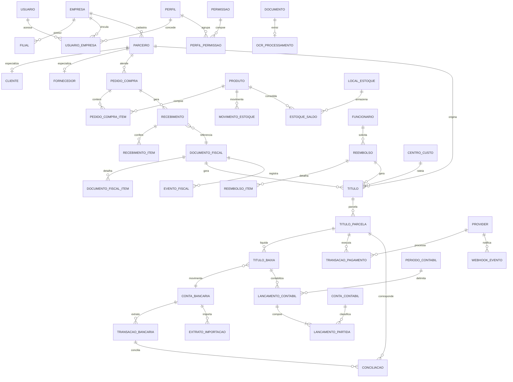

# Modelo Conceitual de Dados

**Sistema Integrado de Gestão Empresarial e Financeira — ERS v1.0**

---

## 1. Princípios de modelagem

| # | Princípio | Origem |
|---|-----------|--------|
| 1 | Toda entidade operacional carrega `empresa_id` (tenant lógico) | RN-001, RF-005 |
| 2 | Isolamento reforçado no banco via **Row Level Security** por `empresa_id` | RN-002, RNF-004 |
| 3 | Chaves primárias em `uuid` (geração distribuída, sem vazamento de volume) | — |
| 4 | Valores monetários em `numeric(18,2)`; quantidades e custos unitários em `numeric(18,6)` | RN-012 |
| 5 | Entidades de histórico são *append-only* (baixas, movimentos, auditoria) | RN-006, RN-009, RN-010 |
| 6 | Idempotência garantida por unicidade em banco, não apenas em aplicação | RN-004, RN-005 |
| 7 | Integrações externas isoladas atrás de `provider` + `credencial_integracao` | RNF-011 |
| 8 | Soft delete via `ativo`; exclusão física restrita por `ON DELETE RESTRICT` em dados transacionais | RN-006 |

---

## 2. Decisões de projeto que divergem da leitura literal da ERS

Três pontos merecem atenção porque consolidam entidades que a ERS descreve separadamente.

**Parceiro único em vez de Cliente e Fornecedor separados.** Na prática a mesma pessoa jurídica frequentemente exerce os dois papéis, e duplicar cadastro gera divergência de dados e conciliação inconsistente. A tabela `parceiro` concentra os dados comuns, com os *flags* `eh_cliente` / `eh_fornecedor`, e as tabelas `cliente` e `fornecedor` (1:1) guardam apenas o que é específico de cada papel — limite de crédito, vendedor, prazo de entrega, homologação.

**Título único em vez de Conta a Pagar e Conta a Receber separadas.** Parcelamento, juros, multa, baixa parcial, estorno e conciliação são idênticos nos dois sentidos; separar as tabelas duplicaria toda a lógica. A entidade `titulo` é discriminada por `tipo` (`PAGAR` / `RECEBER`), e as views `vw_conta_pagar` / `vw_conta_receber` preservam a nomenclatura da ERS na camada de consulta.

**Endereços, contatos e dados bancários com FK controlada.** Em vez de FK polimórfica solta (`entidade` + `entidade_id`, sem integridade referencial), essas tabelas têm colunas FK reais para cada possível proprietário mais um `CHECK` que exige exatamente uma preenchida. Assim o banco continua garantindo integridade.

---

## 3. Entidades por domínio

### Núcleo e segurança (M01, M02)

`empresa`, `filial`, `endereco`, `contato`, `centro_custo`, `categoria_financeira`, `parametro_empresa`, `usuario`, `perfil`, `permissao`, `perfil_permissao`, `usuario_empresa`, `sessao`, `token_recuperacao`, `alcada`, `alcada_aprovador`, `aprovacao`

A tabela `aprovacao` é genérica: atende pedido de compra, título, reembolso e pagamento por meio de `entidade` + `entidade_id`, evitando uma tabela de aprovação por módulo.

### Pessoas e cadastros (M03, M04, M05)

`departamento`, `cargo`, `funcionario`, `funcionario_evento`, `verba`, `funcionario_verba`, `reembolso`, `reembolso_item`, `dado_bancario`, `parceiro`, `cliente`, `fornecedor`, `forma_pagamento`, `condicao_pagamento`, `unidade_medida`, `categoria_produto`, `produto`, `produto_fornecedor`, `local_estoque`, `estoque_saldo`, `movimento_estoque`, `inventario`, `inventario_item`

`movimento_estoque` funciona como razão do estoque; `estoque_saldo` é a projeção consolidada, mantida por trigger com custo médio ponderado.

### Operações e financeiro (M06, M07, M08, M09, M10)

`pedido_compra`, `pedido_compra_item`, `recebimento`, `recebimento_item`, `documento_fiscal`, `documento_fiscal_item`, `documento`, `recorrencia`, `titulo`, `titulo_parcela`, `titulo_baixa`, `provider`, `credencial_integracao`, `conta_bancaria`, `idempotencia`, `transacao_pagamento`, `webhook_evento`, `job_execucao`, `extrato_importacao`, `transacao_bancaria`, `regra_conciliacao`, `conciliacao`

### Contábil, fiscal e governança (M11 a M18)

`conta_contabil`, `periodo_contabil`, `lancamento_contabil`, `lancamento_partida`, `parametro_fiscal`, `classificacao_fiscal`, `regra_fiscal`, `evento_fiscal`, `ocr_processamento`, `cenario_fluxo_caixa`, `projecao_fluxo_caixa`, `alerta_caixa`, `auditoria`, `notificacao`, `regra_automacao`, `regra_automacao_execucao`, `integracao`, `integracao_log`

---

## 4. Diagrama Entidade-Relacionamento (núcleo transacional)



---

## 5. Fluxo Compra → Pagamento no modelo

```
pedido_compra ─ aprovacao ─→ recebimento ─→ documento_fiscal
                                  │                │
                                  ↓                ↓
                        movimento_estoque       titulo (PAGAR)
                                  │                │
                                  │                ↓
                                  │          titulo_parcela
                                  │                │
                                  │                ↓
                                  │       transacao_pagamento ←─ webhook_evento
                                  │                │
                                  │                ↓
                                  │          titulo_baixa
                                  │                │
                                  │                ↓
                                  └────→ lancamento_contabil ←─ conciliacao ←─ transacao_bancaria
```

---

## 6. Regras de negócio implementadas no próprio banco

| Regra | Implementação |
|-------|---------------|
| RN-001 | `empresa_id NOT NULL` em toda tabela operacional |
| RN-002 | Políticas RLS geradas para todas as tabelas com `empresa_id` |
| RN-004 | `UNIQUE (empresa_id, idempotency_key)` em `transacao_pagamento` |
| RN-005 | `UNIQUE (provider_id, evento_id_externo)` em `webhook_evento` + tabela `idempotencia` |
| RN-006 | `titulo_baixa` sem exclusão física; estorno via `estorno_de_id` |
| RN-007 | Índice único parcial sobre `(empresa_id, chave_acesso)` em `documento_fiscal` |
| RN-008 | Trigger `fn_valida_periodo_fechado` bloqueia lançamento em período fechado |
| RN-009 | Estornos como novos registros com referência ao original |
| RN-010 | Trigger `fn_auditoria_generica` em 21 entidades críticas |
| RN-012 | Domínios `dom_valor`, `dom_valor_unit`, `dom_quantidade`, `dom_percentual` |
| Partida dobrada | *Constraint trigger deferred* validando débito = crédito no commit |
| Conta sintética | Trigger impede lançamento em conta que não aceita movimento |
| RF-118 | Trigger bloqueia `UPDATE` e `DELETE` na tabela `auditoria` |

---

## 7. Rastreabilidade Requisito → Estrutura

| Módulo | RF | Tabelas / objetos principais |
|--------|-----|------------------------------|
| M01 | RF-001 a RF-006 | `empresa`, `filial`, `endereco`, `centro_custo`, `categoria_financeira`, `parametro_empresa` |
| M02 | RF-007 a RF-012 | `usuario`, `sessao`, `token_recuperacao`, `perfil`, `permissao`, `perfil_permissao`, `alcada`, `aprovacao` |
| M03 | RF-013 a RF-021 | `funcionario`, `cargo`, `departamento`, `funcionario_evento`, `verba`, `funcionario_verba`, `reembolso`, `dado_bancario` |
| M04 | RF-022 a RF-027 | `parceiro`, `cliente`, `fornecedor`, `contato`, `condicao_pagamento`, `forma_pagamento`, `produto_fornecedor` |
| M05 | RF-028 a RF-035 | `produto`, `categoria_produto`, `unidade_medida`, `local_estoque`, `estoque_saldo`, `movimento_estoque`, `inventario`, `vw_estoque_alerta_minimo` |
| M06 | RF-036 a RF-042 | `pedido_compra`, `pedido_compra_item`, `recebimento`, `recebimento_item`, `aprovacao` |
| M07 | RF-043 a RF-050 | `documento_fiscal`, `documento_fiscal_item`, `documento` |
| M08 | RF-051 a RF-058 | `titulo`, `titulo_parcela`, `titulo_baixa`, `recorrencia`, `vw_titulos_vencidos` |
| M09 | RF-059 a RF-070 | `conta_bancaria`, `provider`, `credencial_integracao`, `transacao_pagamento`, `webhook_evento`, `idempotencia`, `job_execucao` |
| M10 | RF-071 a RF-077 | `extrato_importacao`, `transacao_bancaria`, `regra_conciliacao`, `conciliacao` |
| M11 | RF-078 a RF-087 | `conta_contabil`, `periodo_contabil`, `lancamento_contabil`, `lancamento_partida`, `vw_razao_contabil`, `vw_balancete`, `vw_dre` |
| M12 | RF-088 a RF-094 | `parametro_fiscal`, `classificacao_fiscal`, `regra_fiscal`, `evento_fiscal` |
| M13 | RF-095 a RF-100 | `documento`, `ocr_processamento` |
| M14 | RF-101 a RF-105 | `cenario_fluxo_caixa`, `projecao_fluxo_caixa`, `alerta_caixa`, `vw_fluxo_caixa` |
| M15 | RF-106 a RF-113 | Views analíticas + índices de filtro por período, empresa, filial, categoria e centro de custo |
| M16 | RF-114 a RF-118 | `auditoria` (particionada, imutável) |
| M17 | RF-119 a RF-125 | `notificacao`, `regra_automacao`, `regra_automacao_execucao` |
| M18 | RF-126 a RF-131 | `integracao`, `integracao_log`, `provider`, `credencial_integracao` |

---

## 8. Instalação

```bash
createdb gestao_empresarial
psql -d gestao_empresarial -v ON_ERROR_STOP=1 -f 01_schema_core.sql
psql -d gestao_empresarial -v ON_ERROR_STOP=1 -f 02_schema_financeiro.sql
psql -d gestao_empresarial -v ON_ERROR_STOP=1 -f 03_schema_contabil_governanca.sql

# opcional: validação funcional
psql -d gestao_empresarial -f 99_smoke_test.sql
```

Requer PostgreSQL 14 ou superior (validado em 16.14). Extensões usadas: `pgcrypto`, `pg_trgm`, `btree_gist`, `unaccent`.

### Contexto de sessão obrigatório

A aplicação precisa definir o contexto a cada requisição, antes de qualquer query — sem isso, as políticas de RLS não retornam nenhuma linha:

```sql
SET LOCAL app.empresa_id     = '<uuid da empresa>';
SET LOCAL app.usuario_id     = '<uuid do usuário>';
SET LOCAL app.origem         = 'API';        -- ou WORKER, WEBHOOK
SET LOCAL app.correlation_id = '<trace id>'; -- RNF-010
```

Com Prisma, isso vai em um *middleware* de transação; com NestJS, em um interceptor que executa os `SET LOCAL` na conexão antes de liberar o repositório.

---

## 9. Pontos de manutenção contínua

**Partições de auditoria.** Existem partições até setembro de 2026 mais uma `DEFAULT`. É preciso um job mensal criando a partição do mês seguinte, senão tudo cai na `DEFAULT` e o desempenho degrada.

**Expiração de idempotência.** A tabela `idempotencia` cresce indefinidamente; um job diário deve remover registros com `expira_em < now()`.

**Custo médio de estoque.** A trigger recalcula custo médio ponderado apenas em entradas. Se o negócio exigir PEPS/UEPS, será necessária uma tabela de camadas de custo por lote.

**Numeração de documentos.** `numero` em `pedido_compra`, `titulo`, `recebimento` e `reembolso` é `varchar` com unicidade por empresa, mas a geração da sequência fica a cargo da aplicação — vale criar sequences por empresa ou uma tabela de contadores com bloqueio, para evitar colisão sob concorrência.
